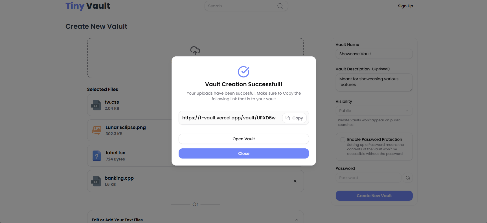
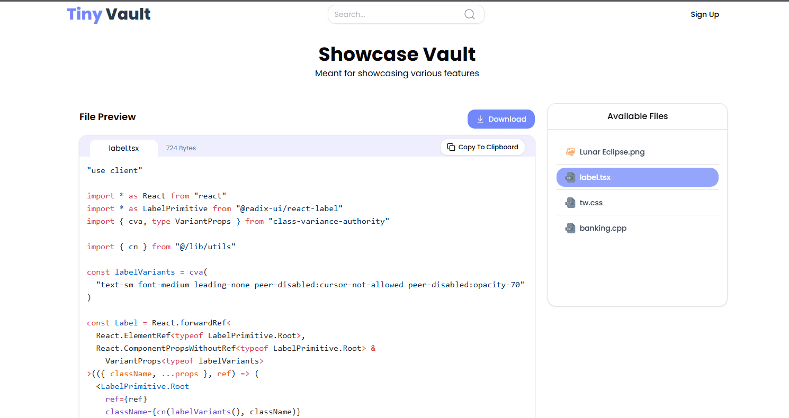

# 🔐 Tiny Vault

**Tiny Vault** is a lightweight, zero-signup file vault system built for quickly sharing small files and code snippets. Inspired by Pastebin, but supercharged — now with file upload, vault protection, live previews, and more. Built for speed, simplicity, and secure sharing.

Live Site: [t-vault.vercel.app](https://t-vault.vercel.app/)  
Sample Vault: [View Example](https://t-vault.vercel.app/vault/UI1XD6w)

---

## ✨ Features

- 🔼 **Drag & Drop File Uploads** — Upload anything from docs to code files using an intuitive drag-and-drop interface.
- 📝 **Text & Code Customization** — Quickly create, edit, and preview text/code files right from the web.
- 🔐 **Password-Protected Vaults** — Keep your vaults private with secure password protection (stored securely in cookies).
- 🧪 **Live Syntax Highlighting** — Code files are syntax-highlighted automatically for formats like JS, CSS, HTML, C++, Java, and more.
- 🔗 **Unique Vault URLs** — Each vault gets a unique sharable link for instant access.
- 📦 **Download Options** — Download files individually or grab everything at once as a ZIP.

---

## 🧠 Behind the Vault

### ⚙️ Tech Stack

- **Frontend**: React + Next.js
- **Database**: Drizzle ORM + Turso (LibSQL SQLite)
- **Styling**: Tailwind CSS, Shadcn UI
- **State Management**: [Jotai](https://jotai.org/)
- **File Uploads**: [UploadThing](https://uploadthing.com/)
- **Caching**: Redis
- **Auth & Security**: JWTs + Cookies (device fingerprinting, session validation)

### 🔐 Security Model

- No user accounts required, but vault creation is secured with a device-bound JWT for public vaults.
- JWT is generated server-side with request-based fingerprinting and stored in a cookie.
- Every file upload and vault action is authenticated via this JWT.
- Vault creation finalizes only after verifying JWT contents and uploading all data.
- Password-protected vaults are validated on access, with passwords stored temporarily in cookies.

### 🚀 Vault Creation Flow

1. **User starts a vault session** → server returns a JWT.
2. **Files are uploaded** → temporarily stored in Redis cache.
3. **Vault is finalized** → metadata and files are pushed into the database.
4. **Unique URL is generated** → shared with the user for access.

---

## 💡 Bonus Details

- 🔄 Supports drag-and-drop uploads and inline file creation.
- 🌐 Vaults are public by default but can be hidden via "Private" mode.
- 🧩 Vault contents and file metadata are neatly structured for ease of access.
- 🧰 No login required — just open the site and start uploading.

---

## 📸 Screenshots

### Upload Interface



### Vault Preview



---

## 🛠️ Local Development

```bash
git clone https://github.com/Towhidkarim/tiny-vault.git
cd tiny-vault
npm install
npm run dev
```
